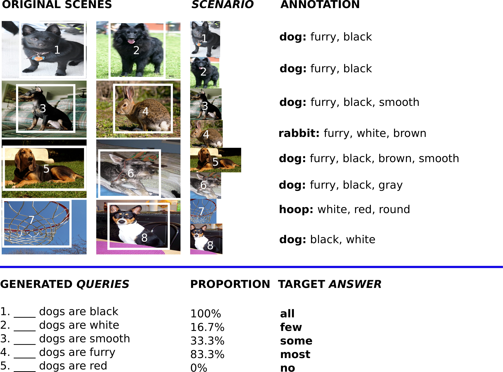

## Q-Team

<table class='organizer-pics-four'>
    <tr>
        <td>
        
        </td>
        <td>
        
        </td>
        <td>
        
        </td>
        <td>
        
        </td>
    </tr>

    <tr>
        <td><a href='http://sandropezzelle.github.io/'>Sandro Pezzelle</a>   CIMeC, University of Trento </td>

        <td><a href=''>Ionut-Teodor Sorodoc</a>  
        Universitat Pompeu Fabra </td>

        <td><a href='http://aurelieherbelot.net/'>Aurelie Herbelot</a>  
        tba </td>

        <td> <a href='http://disi.unitn.it/~bernardi/'>Raffaella Bernardi</a>  
        CIMeC, DISI, University of Trento</td>
    </tr>
</table>

## Comparatives, Quantifiers, Proportions: A Multi-Task Model for the Learning of Quantities from Vision

Pezzelle, S., Sorodoc, I., Bernardi, R.

The present work investigates whether different quantification mechanisms (set comparison, vague quantification, and proportional estimation) can be jointly learned from visual scenes by a multi-task computational model. The motivation is that, in humans, these processes underlie the same cognitive, non-symbolic ability, which allows an automatic estimation and comparison of set magnitudes. We show that when information about lower-complexity tasks is available, the higher-level proportional task becomes more accurate than when performed in isolation. Moreover, the multi-task model is able to generalize to unseen combinations of target/non-target objects. Consistently with behavioral evidence showing the interference of absolute number in the proportional task, the multi-task model no longer works when asked to provide the number of target objects in the scene.

    

    
    

    

## Learning Quantification from Images: A Structured Neural Architecture

Sorodoc, I., Pezzelle, S., Herbelot, A., Dimiccoli, M., Bernardi, R.

Major advances have recently been made in merging language and vision representations.
Most tasks considered so far have confined themselves to the processing of objects and
lexicalised relations amongst objects (content words). We know, however, that humans
(even pre-school children) can abstract over raw multimodal data to perform certain types
of higher-level reasoning, expressed in natural language by function words. A case in point
is given by their ability to learn quantifiers, i.e. expressions like few, some and all.
From formal semantics and cognitive linguistics we know that quantifiers are relations
over sets which, as a simplification, we can see as proportions. For instance, in most fish
are red, most encodes the proportion of fish which are red fish. In this paper, we study
how well current neural network strategies model such relations. We propose a task where,
given an image and a query expressed by an object-property pair, the system must return
a quantifier expressing which proportions of the queried object have the queried property.
Our contributions are twofold. First, we show that the best performance on this task involves coupling state-of-the-art attention mechanisms with a network architecture mirroring the logical structure assigned to quantifiers by classic linguistic formalisation. Second,
we introduce a new balanced dataset of image scenarios associated with quantification
queries, which we hope will foster further research in this area.

    

    
    
    

## Be Precise or Fuzzy: Learning the Meaning of Cardinals and Quantifiers from Vision

Pezzelle, S., Marelli, M., Bernardi, R.

People can refer to quantities in a visual scene
by using either exact cardinals (e.g. one, two,
three) or natural language quantifiers (e.g. few,
most, all). In humans, these two processes
underlie fairly different cognitive and neural
mechanisms. Inspired by this evidence, the
present study proposes two models for learning the objective meaning of cardinals and
quantifiers from visual scenes containing multiple objects. We show that a model capitalizing on a ‘fuzzy’ measure of similarity is effective for learning quantifiers, whereas the learning of exact cardinals is better accomplished
when information about number is provided. 

    

    
    
    

## "Look, Some Green Circles!": Learning to Quantify from Images

Sorodoc, I., Lazaridou, A., Boleda, G., Herbelot, A., Pezzelle, S., Bernardi, R.

In this paper, we investigate whether a
neural network model can learn the meaning of natural language quantifiers (no,
some and all) from their use in visual contexts. We show that memory networks perform well in this task, and that explicit
counting is not necessary to the system’s
performance, supporting psycholinguistic
evidence on the acquisition of quantifiers. 

    

    
    

